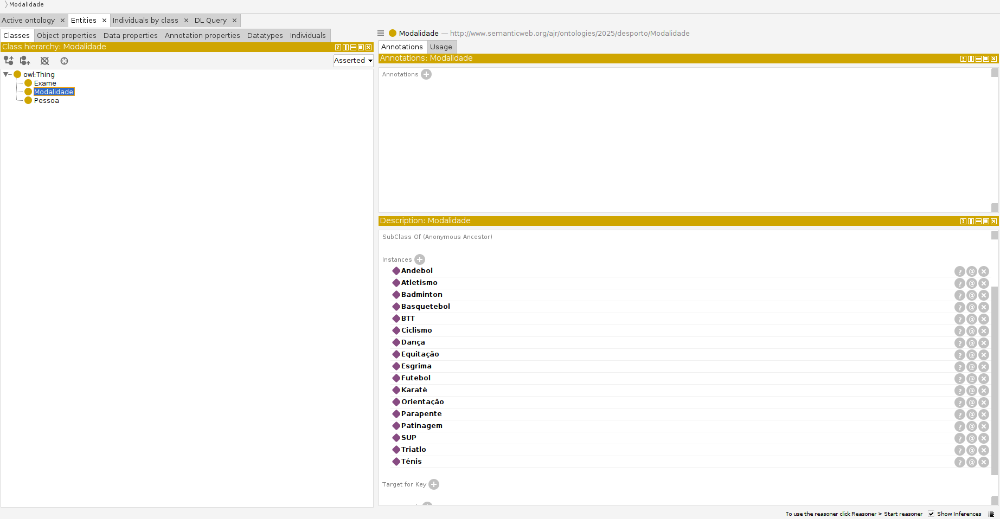
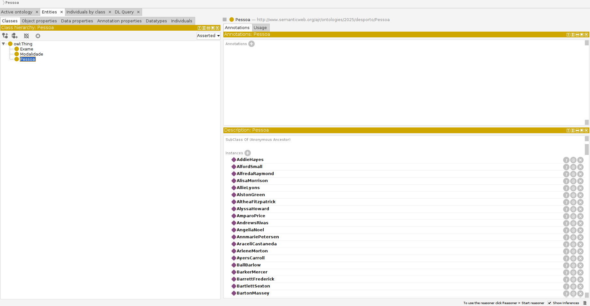
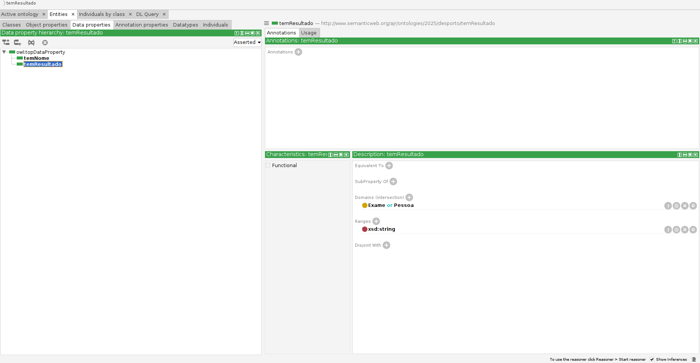
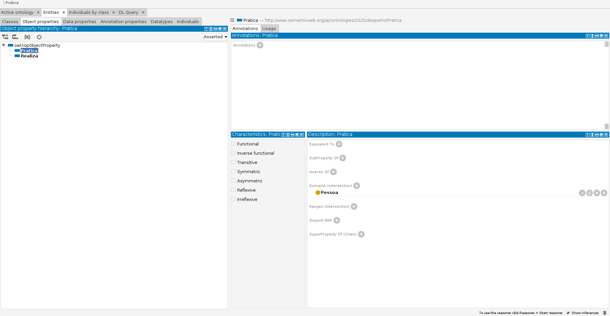

## Conversão de JSON para RDF/Turtle (TTL)

Este TPC tem como objetivo converter um arquivo JSON com informações de modalidades desportivas e pessoas para o formato RDF/Turtle (TTL), seguindo uma ontologia pré-definida. O código lê os dados de um arquivo JSON, processa essas informações, e as grava em um arquivo TTL que pode ser utilizado em um sistema de dados semânticos (como um triplestore ou ferramenta de raciocínio).

## Estrutura do Código

### Funções principais

1. **`Individuals_modalidade(modalidades_set)`**:
   - **Descrição**: Esta função recebe um conjunto de modalidades (`modalidades_set`) e gera as declarações necessárias para criar um `NamedIndividual` para cada modalidade. Cada modalidade é representada no formato RDF/Turtle como uma instância do tipo `Modalidade`, com a propriedade `temNome` associada ao nome da modalidade.
   - **Saída**: Retorna uma string com as declarações RDF/Turtle de todas as modalidades.

2. **`json_to_ttl(json_file, ttl_file)`**:
   - **Descrição**: Esta é a função principal que orquestra a conversão. Ela lê os dados de um arquivo JSON, que contém informações sobre modalidades e pessoas, e escreve as declarações RDF/Turtle no arquivo de saída especificado (`ttl_file`).
   - **Passos**:
     - Lê o arquivo JSON usando `json.load`.
     - Cria um conjunto de modalidades (`modalidades_set`) que armazena todas as modalidades encontradas no arquivo JSON.
     - Chama as funções auxiliares (`ObjectProperties()`, `Dataproperties()`, `Classes()`, `Individuals()`, `Individuals_pessoas()`) para gerar outras partes do código TTL, como as propriedades e classes da ontologia.
     - No final, chama `Individuals_modalidade()` para gerar as declarações relacionadas às modalidades.
   - **Saída**: Gera um arquivo TTL (`ttl_file`) com os dados RDF completos, incluindo as modalidades e pessoas.

### Estrutura do Arquivo JSON Esperado

O arquivo JSON (`emd.json`) deve conter uma lista de objetos com informações sobre pessoas e suas modalidades esportivas. Um exemplo de estrutura de dados poderia ser:

```json
[
  {
    "nome": {
      "primeiro": "Emily",
      "último": "Terrell"
    },
    "modalidade": "Futebol"
  },
  {
    "nome": {
      "primeiro": "John",
      "último": "Doe"
    },
    "modalidade": "Basquete"
  }
]
```

Cada objeto no JSON possui um campo nome, que é um objeto com primeiro e último nome, e um campo modalidade, que representa o nome do esporte ou atividade.
Estrutura do Arquivo TTL Gerado

O arquivo de saída (ontologia.ttl) segue o formato RDF/Turtle e inclui as informações sobre a ontologia, as propriedades, classes e indivíduos (modalidades e pessoas). Exemplo de saída para a modalidade "Futebol":
```
@prefix : <http://www.semanticweb.org/ajr/ontologies/2025/desporto/> .
@prefix owl: <http://www.w3.org/2002/07/owl#> .
@prefix rdf: <http://www.w3.org/1999/02/22-rdf-syntax-ns#> .
@prefix xsd: <http://www.w3.org/2001/XMLSchema#> .
@prefix rdfs: <http://www.w3.org/2000/01/rdf-schema#> .
@base <http://www.semanticweb.org/ajr/ontologies/2025/desporto/> .
<http://www.semanticweb.org/ajr/ontologies/2025/desporto> rdf:type owl:Ontology .

###  http://www.semanticweb.org/ajr/ontologies/2025/desporto#Futebol

:Futebol rdf:type owl:NamedIndividual ,
                 :Modalidade ;
        :temNome "Futebol" .

:Futebol rdf:type owl:NamedIndividual ,
                 :Pessoa ;
        :temNome "Emily Terrell" .
```

## Fluxo de Execução

    O script começa com a função json_to_ttl que lê o arquivo JSON fornecido.
    A função cria um conjunto (modalidades_set) para armazenar as modalidades.
    Para cada entrada no JSON:
        As informações sobre a pessoa e a modalidade são processadas.
        Funções auxiliares geram declarações sobre propriedades, classes e indivíduos.
    No final, a função Individuals_modalidade gera declarações RDF para cada modalidade.
    O arquivo TTL gerado inclui todas as informações no formato RDF/Turtle.

## Exemplo de Uso

Para usar este código, basta chamar a função json_to_ttl com o arquivo JSON de entrada e o nome do arquivo TTL de saída.

json_to_ttl('emd.json', 'ontologia.ttl')

Isso irá gerar o arquivo ontologia.ttl contendo a representação RDF das modalidades e pessoas descritas no arquivo emd.json.

## Resultados na interface








