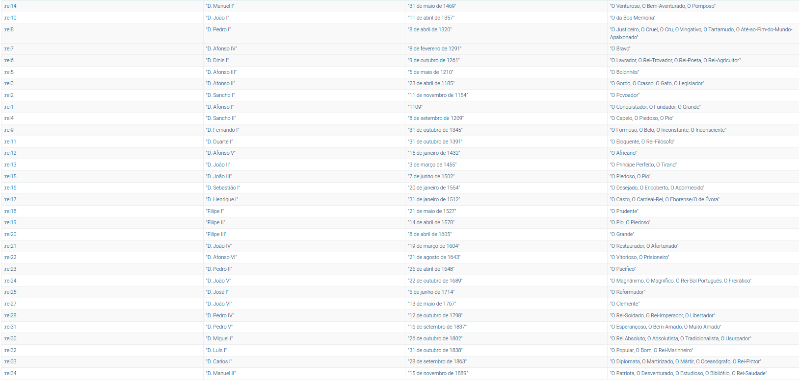
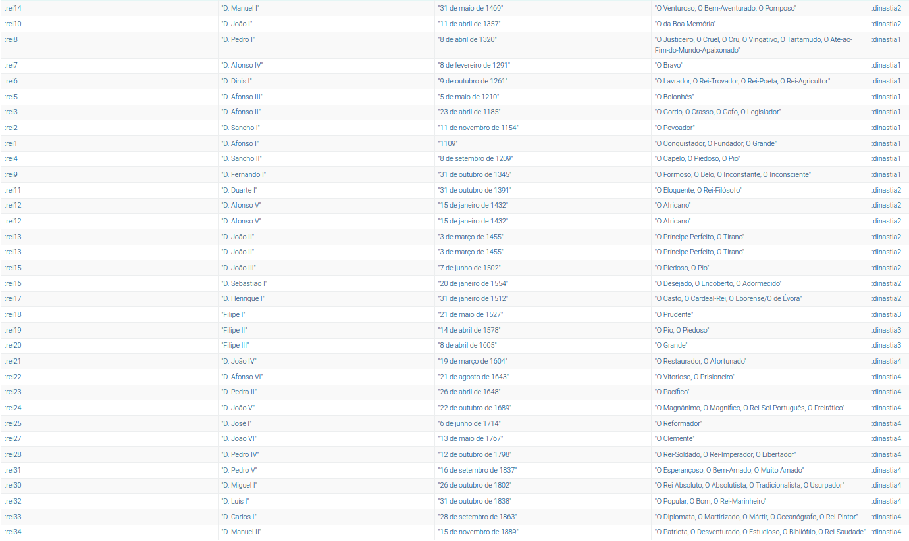
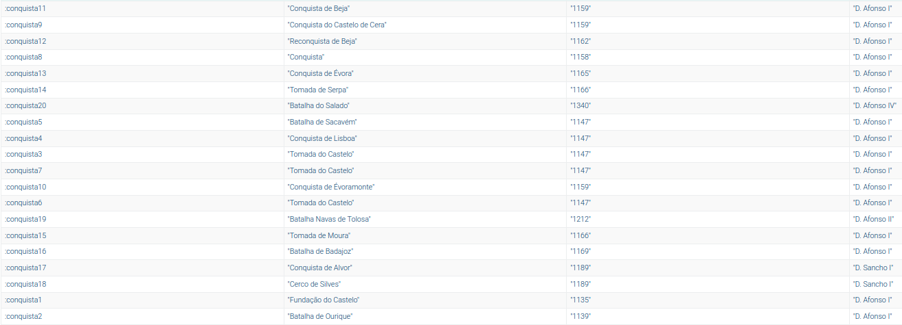
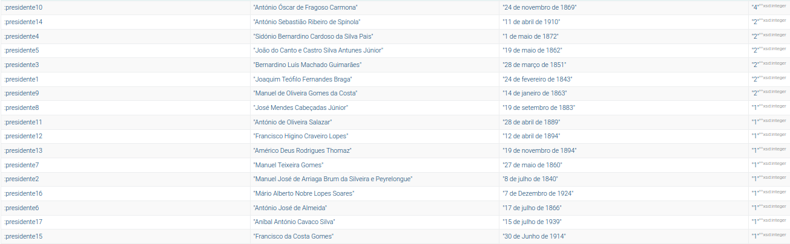

## 1-Quantos triplos existem na Ontologia?

```
PREFIX : <http://www.semanticweb.org/andre/ontologies/2015/6/historia#>
select * where {
    ?s ?o ?p
}
```

Existem 6603

## 2-Que classes estão definidas?

```
PREFIX owl: <http://www.w3.org/2002/07/owl#>
PREFIX : <http://www.semanticweb.org/andre/ontologies/2015/6/historia#>
select ?classe where {
    ?classe rdf:type owl:Class.
}
```
Estão definidas 102 classes sendo elas: rdfs:Class, owl:Class, owl:Thing, owl:Nothing, rdf:List, rdf:Statement, rdfs:Literal, rdfs:Container, rdfs:Datatype, owl:Annotation, owl:Axiom, owl:DataRange, owl:DeprecatedClass, owl:Ontology, owl:Restriction, :Rainha, :Monarca, :Casa, :Individuo, :Regime, :Batalha, :Acontecimento, :Partido, :Dinastia, :Descobrimento, :Local, :Reinado, :Conquista, :Mandato, :Rei e :Presidente.

## 3-Que propriedades tem a classe "Rei"?

```
PREFIX owl: <http://www.w3.org/2002/07/owl#>
PREFIX : <http://www.semanticweb.org/andre/ontologies/2015/6/historia#>
select distinct ?prop where {
    ?s a :Rei .
    ?s ?prop ?o. 
} order by ?prop
```

A classe Rei tem as seguintes propriedades: :ascendente,:casa,:cognomes, :descendente, :enterro, :localNascimento, :morte, :nascimento, :nome, :notas, :posicao, :predecessor, :sucessor, :temReinado, rdf:type, owl:topObjectProperty

## 4-Quantos reis aparecem na ontologia?

```
PREFIX owl: <http://www.w3.org/2002/07/owl#>
PREFIX : <http://www.semanticweb.org/andre/ontologies/2015/6/historia#>
select (count (distinct ?s) as ?numero) where {
    ?s a :Rei .
} 
```

Existem 32 reis

## 5-Calcula uma tabela com o seu nome, data de nascimento e cognome

```
PREFIX owl: <http://www.w3.org/2002/07/owl#>
PREFIX : <http://www.semanticweb.org/andre/ontologies/2015/6/historia#>
select ?s ?n ?d ?c where {
    ?s a :Rei .
    ?s :nome ?n.
    ?s :nascimento ?d.
    ?s :cognomes ?c.
} 
```
**Tabela:** 


## 6-Acescenta à tabela anterior a dinastia em que cada rei reinou

```
PREFIX owl: <http://www.w3.org/2002/07/owl#>
PREFIX : <http://www.semanticweb.org/andre/ontologies/2015/6/historia#>
select distinct ?s ?n ?d ?c ?r ?di where {
    ?s a :Rei .
    ?s :nome ?n.
    ?s :nascimento ?d.
    ?s :cognomes ?c.
    ?s :temReinado ?r.
    ?r :dinastia ?di
} 
```

Se quiser esconder o "temReinado" posso fazer da seguinte forma:

```
PREFIX owl: <http://www.w3.org/2002/07/owl#>
PREFIX : <http://www.semanticweb.org/andre/ontologies/2015/6/historia#>
select distinct ?s ?n ?d ?c ?di where {
    ?s a :Rei .
    ?s :nome ?n.
    ?s :nascimento ?d.
    ?s :cognomes ?c.
    ?s :temReinado/:dinastia ?di.
} 
```
**Tabela:** 

## 7-Qual a distribuição de reis pelas 4 dinastias?

```
PREFIX owl: <http://www.w3.org/2002/07/owl#>
PREFIX : <http://www.semanticweb.org/andre/ontologies/2015/6/historia#>
select  (count  (distinct ?s) as ?conta) ?di where {
    ?s a :Rei .
    ?s :temReinado/:dinastia ?di.
}  
group by ?di
order by desc (?conta)

```
"12" :dinastia4

"9" :dinastia1

"8" :dinastia2

"3" :dinastia3

## 8-Lista os descobrimentos (sua descrição) por ordem cronológica

```
PREFIX owl: <http://www.w3.org/2002/07/owl#>
PREFIX : <http://www.semanticweb.org/andre/ontologies/2015/6/historia#>
select distinct ?prop where {
    ?s a :Descobrimento .
    ?s ?prop ?o. 
} order by ?prop
```

A classe descobrimentos terá as seguintes propriedades: :data, :notas, :oceano, :temLocal, :temReinado, rdf:type 

Para ordenar por ordem cronológica: 

```
PREFIX owl: <http://www.w3.org/2002/07/owl#>
PREFIX : <http://www.semanticweb.org/andre/ontologies/2015/6/historia#>
select distinct ?s ?d where {
    ?s a :Descobrimento .
    ?s :data ?d. 
} 
order by ?d
```

## 9-Lista as várias conquistas, nome e data, juntamente com o nome que reinava no momento

```
PREFIX owl: <http://www.w3.org/2002/07/owl#>
PREFIX : <http://www.semanticweb.org/andre/ontologies/2015/6/historia#>
select distinct ?prop where {
    ?s a :Conquista .
    ?s ?prop ?o. 
} order by ?prop
```

As propriedades de conquista são: :data, :nome, :temLocal, :temReinado, rdf:type
Lista as conquistas, nome, data e quem reinava no momento
```
PREFIX owl: <http://www.w3.org/2002/07/owl#>
PREFIX : <http://www.semanticweb.org/andre/ontologies/2015/6/historia#>
select distinct ?s ?n ?d ?r where {
    ?s a :Conquista .
    ?s :nome ?n.
    ?s :data ?d.
    ?s :temReinado/:temMonarca/:nome ?r
} 
```

**Tabela:** 


## 10-Calcula uma tabela com o nome, data de nascimento e número de mandatos de todos os presidentes portugueses.

```
PREFIX owl: <http://www.w3.org/2002/07/owl#>
PREFIX : <http://www.semanticweb.org/andre/ontologies/2015/6/historia#>
select distinct ?prop where {
    ?s a :Presidente .
    ?s ?prop ?o. 
} order by ?prop
```

Presidente tem as seguintes propriedades: :localNascimento, :mandato, :morte, :nascimento, :nome, :partido, rdf:type

```
PREFIX owl: <http://www.w3.org/2002/07/owl#>
PREFIX : <http://www.semanticweb.org/andre/ontologies/2015/6/historia#>
select distinct ?s ?n ?d (count (?m) as ?contamandatos)  where {
    ?s a :Presidente .
    ?s :nome ?n.
    ?s :nascimento ?d.
    ?s :mandato ?m            
} 
group by ?s ?n ?d
order by desc(?contamandatos)
```

**Tabela:** 


## 11-Quantos mandatos teve o presidente Sidónio Pais? Em que datas iniciaram e terminaram esses mandatos?

Numero de mandatos é 2, as datas de inicio sao "12 de dezembro de 1917, 27 de dezembro de 1917" e de fim sao "27 de dezembro de 1917, 14 de dezembro de 1918" por:

```
PREFIX owl: <http://www.w3.org/2002/07/owl#>
PREFIX : <http://www.semanticweb.org/andre/ontologies/2015/6/historia#>

SELECT (COUNT(DISTINCT ?m) AS ?totalMandatos) 
       (GROUP_CONCAT(DISTINCT ?mc; separator=", ") AS ?datasInicio)
       (GROUP_CONCAT(DISTINCT ?mf; separator=", ") AS ?datasFim) 
WHERE {  
    ?s a :Presidente .  
    ?s :nome "Sidónio Bernardino Cardoso da Silva Pais".  
    ?s :mandato ?m.  
    ?m :comeco ?mc.  
    ?m :fim ?mf.  
}
```

## 12-Quais os nomes dos partidos politicos presentes na ontologia?

Os nomes dos partidos polítcos são: "Independente", "União Nacional", "Nacional Republicano", 
"Democrático", "Republicano", "Socialista", "Evolucionista", "Liberal", "Nacionalista", "Social Democrata"

```
PREFIX owl: <http://www.w3.org/2002/07/owl#>
PREFIX : <http://www.semanticweb.org/andre/ontologies/2015/6/historia#>
select distinct ?n where {
    ?s a :Partido.
    ?s :nome ?n. 
}

```

## 13-Qual a distribuição dos militantes por cada partido politico?

```
PREFIX owl: <http://www.w3.org/2002/07/owl#>
PREFIX : <http://www.semanticweb.org/andre/ontologies/2015/6/historia#>
select  (count  (distinct ?m) as ?conta) ?n where {
    ?s a :Partido .
    ?s :nome ?n.
    ?s :temMilitante ?m.
}  
group by ?n
order by desc (?conta)
```

4	Independente
4	União Nacional
2	Nacional Republicano
2	Democrático
2	Republicano
1	Socialista
1	Evolucionista
1	Liberal
1	Nacionalista
1	Social Democrata

## 14-Qual o partido com maior número de presidentes militantes?


Independente