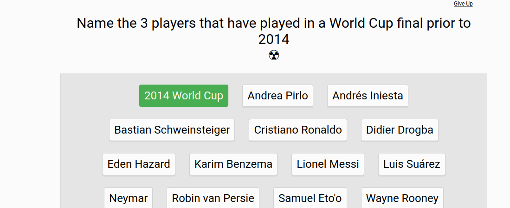

## Perguntas 

Which country has won the most World Cups?

Which country hosted the 2022 World Cup?

In 2010, which one of these teams was not in the semifinals?

Prior to the 2026 World Cup, which goalkeeper holds the record for the most saves in a single World Cup match?

Which country won the World Cup in 2018?

rior to the 2026 World Cup, which player is the all-time leading goal scorer in World Cup history?

In what year did the World Cup competition start?

Starting in 2026, how many national teams will compete in the World Cup?

What is the name of Diego Maradona’s infamous first goal against England in 1986?

At what stage were England knocked out of the 2018 FIFA World Cup in Russia?

Which nation will England not face in Group B at the 2022 FIFA World Cup in Qatar?

Former Baggie Robert Koren competed at which FIFA World Cup for Slovenia?

When was the last time Brazil won the FIFA World Cup?

Where was the 2002 FIFA World Cup held?

Which nation defeated England on penalties at the 2006 FIFA World Cup in Germany?

Which man holds the record for scoring the most goals in the history of the FIFA World Cup?

Which England player scored a hat-trick against Germany in the 1966 FIFA World Cup final?